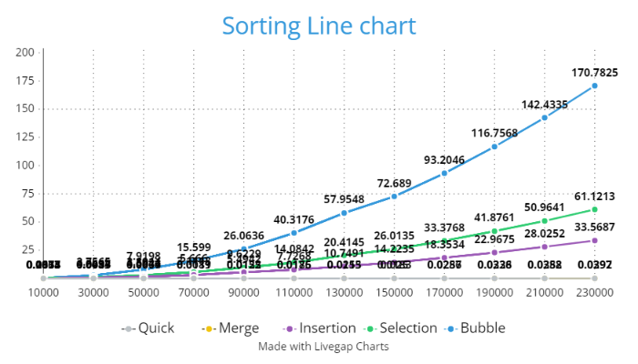

# Sort Analysis Data

## Results Table
Make sure to go out to at least 100,000 (more are welcome), and you have 10 different values (more welcome). You are welcome to go farther, but given 100,000 can take about 20 seconds using a selection sort on a fast desktop computer, and 200,000 took 77 seconds, you start having to wait much longer the more 0s you add. However, to build a clearer line, you will want more data points, and you will find merge and quick are able to handle higher numbers easier (but at a cost you will explore below). 

You are free to write a script to run the program and build your table (then copy that table built into the markdown). If you do that, please include the script into the repo.  Note: merge and quick sorts are going to be explored in the team activity for Module 06. You can start on it now, but welcome to wait.

### Table [^note]
| N | Bubble | Selection | Insertion | Merge | Quick |
| :-- | :--: | :--: | :--: | :--: | :--: |
| 10000 | 0.2874  | 0.1167    | 0.0634    | 0.0013  | 0.0015  |
| 30000 | 2.7565  | 1.0454    | 0.5697    | 0.0045  | 0.0033  |
| 50000 | 7.9198  | 2.8914    | 1.5944    | 0.0077  | 0.0064  |
| 70000 | 15.5990 | 5.6660    | 3.1113    | 0.0111  | 0.0089  |
| 90000 | 26.0636 | 9.6229    | 5.4942    | 0.0152  | 0.0125  |
| 110000| 40.3176 | 14.0842   | 7.7268    | 0.0185  | 0.0176  |
| 130000| 57.9548 | 20.4145   | 10.7491   | 0.0213  | 0.0155  |
| 150000| 72.6890 | 26.0135   | 14.2235   | 0.0250  | 0.0183  |
| 170000| 93.2046 | 33.3768   | 18.3534   | 0.0287  | 0.0256  |
| 190000| 116.7568| 41.8761   | 22.9675   | 0.0326  | 0.0238  |
| 210000| 142.4335| 50.9641   | 28.0252   | 0.0358  | 0.0282  |
| 230000| 170.7825| 61.1213   | 33.5687   | 0.0392  | 0.0297  |

## BigO Analysis  / Questions

### 1. Build a line chart
Build a line chart using your favorite program. Your X axis will be N increasing, and your Y access will be the numbers for each type of sort. This will create something similar to the graph in the instructions, though it won't be as smooth. Due to speed differences, you may need to break up the $O(\log n)$ and $O(n^2)$ into different charts.

Include the image in your markdown. As a reminder, you save the image in your repo, and use [image markdown].

### 2. Convinced?
Given the direction of the line chart, are you "convinced" of the complexity of each of the sorts? Why or why not?

### 3. Big O
Build another table that presents the best, worst, and average case for Bubble, Selection, Insertion, Merge, and Quick. You are free to use resources for this, but please reference them if you do. 

From the hackerearth [1], the table that presents the best, worst, and average case for Bubble, Selection, Insertion, Merge, and Quick is below:

| Algorithm  | Best Case   | Worst Case  | Average Case |
|------------|-------------|-------------|--------------|
| Bubble     | $O(n)$        | $O(n^2)$      | $O(n^2)$       |
| Selection  | $O(n^2)$      | $O(n^2)$      | $O(n^2)$       |
| Insertion  | $O(n)$        | $O(n^2)$      | $O(n^2)$       |
| Merge      | $O(n\log_2n)$ | $O(n\log_2n)$ | $O(n\log_2n)$  |
| Quick      | $O(n\log_2n)$ | $O(n^2)$      | $O(n\log_2n)$  |

#### 3.2 Worst Case
Provide example of arrays that generate _worst_ case for Bubble, Selection, Insertion, Merge Sorts

1. Worst case for Bubble Sort:
   * Array: [5, 4, 3, 2, 1]
   * This array is in reverse order and Bubble Sort will do the maximum number of comparisons and swaps to sort the array.

2. Worst case for Selection Sort:
   * Array: [5, 4, 3, 2, 1]
   * This array is in reverse order and the smallest element is located at the end of the array. Consequently, Selection Sort will need to perform a swap operation in every iteration, as it compares each element in the unsorted part with the current minimum element and swaps them if necessary. This leads to the maximum number of swaps and comparisons which will result in the worst case time complexity $O(n^2)$.

3. Worst case for Insertion Sort:
   * Array: [5, 4, 3, 2, 1]
   * This array is in reverse order. Insertion Sort will do the maximum number of comparisons and element shifts to sort the array.

4. Worst case for Merge Sort:
   * Array: [1, 3, 5, 7, 2, 4, 6, 8]
   * This array will result the worst case for Merge sorts since when the left and right sub-array are {1,3,5,7} and {2,4,6,8} respectively, then every element for both arrays needs to be compared at least once which will result in the worst time complexity $O(n\log_2n)$. [2]

#### 3.3 Best Case
Provide example of arrays that generate _best_ case for Bubble, Selection, Insertion, Merge Sorts 

1. Best case for Bubble Sort:
   * Array: [1, 2, 3, 4, 5]
   * This array is already sorted in ascending order. Bubble Sort will only require a single pass through the array without any swaps.

2. Best case for Selection Sort:
   * Array: [1, 2, 3, 4, 5]
   * This array is already sorted in ascending order. Selection Sort will perform the minimum number of comparisons and swaps when the array is already sorted. 

3. Best case for Insertion Sort:
   * Array: [1, 2, 3, 4, 5]
   * This array is already sorted in ascending order. Insertion Sort will do a single pass through the array without any element shifts.

4. Best case for Merge Sort:
   * Array: [1, 2, 3, 4, 5]
   * This array is already sorted in ascending order. Merge Sort can merge the sorted subarrays without any additional comparisons or swaps.

#### 3.4 Memory Considerations
Order the various sorts based on which take up the most memory when sorting to the least memory. You may have to research this, and include the mathematical notation.  

When we consider memory usage, sorting algorithms can be ranked based on their memory requirements as follows [3-5]:

1. Merge Sort: Merge Sort is the most intensive algorithm when we consider memory usage. It follows a divide-and-conquer approach and uses extra memory for temporary arrays during the merging process. In the worst-case scenario, Merge Sort requires auxiliary space equal to the input array's size, resulting in a space complexity of $O(n)$.

2. Quick Sort: Quick Sort is also a divide-and-conquer algorithm but typically operates in-place which means it doesn't need additional memory proportional to the input size. The space complexity of Quick Sort is generally considered to be $O(\log_2n)$ due to the recursive partitioning of the array.

3. Selection Sort: Selection Sort is a comparison-based sorting algorithm that doesn't require significant additional memory. It sorts elements by repeatedly selecting the minimum (or maximum) element and swapping it with the current position. The space complexity of Selection Sort is $O(1)$, as it doesn't need any extra memory proportional to the input size.

4. Insertion Sort: Similar to Selection Sort, Insertion Sort is a comparison-based algorithm that operates in-place. It iteratively inserts elements into their correct positions within the sorted portion of the array. Like Selection Sort, Insertion Sort has a space complexity of $O(1)$ since it doesn't require substantial additional memory.

5. Bubble Sort: Bubble Sort is another in-place comparison-based sorting algorithm that repeatedly swaps adjacent elements if they are in the wrong order. Like Selection Sort and Insertion Sort, Bubble Sort has a space complexity of $O(1)$ as it doesn't require additional memory proportional to the input size.

Thus, we order the various sorts based on which take up the most memory when sorting to the least memory:

1. Merge Sort
2. Quick Sort
3. Selection Sort
4. Insertion Sort
5. Bubble Sort

### 4. Growth of Functions
Give the following values, place them correctly into *six* categories. Use the bullets, and feel free to cut and paste the full LatexMath we used to generate them.  

$n^2$  
$n!$  
$n\log_2n$  
$5n^2+5n$  
$10000$  
$3n$    
$100$  
$2^n$  
$100n$  
$2^{(n-1)}$
#### Categories
* $100$, $10000$  
* $3n$, $100n$ 
* $n\log_2n$
* $n^2$, $5n^2+5n$ 
* $2^n$, $2^{(n-1)}$
* $n!$  

### 5. Growth of Function Language

Pair the following terms with the correct function in the table. 
* Constant, Logarithmic, Linear, Quadratic, Cubic, Exponential, Factorial

| Big $O$     |  Name  |
| ------      | ------ |
| $O(n^3)$    |  Cubic |
| $O(1)$      |  Constant |
| $O(n)$      |  Linear |
| $O(\log_2n)$ | Logarithmic  |
| $O(n^2)$    |  Quadratic |
| $O(n!)$     | Factorial  |
| $O(2^n)$    |  Exponential |

### 6. Stable vs Unstable
Look up stability as it refers to sorting. In your own words, describe one sort that is stable and one sort that isn't stable   

* One example of a stable sorting algorithm is Insertion Sort. In Insertion Sort, elements are iteratively inserted into their correct position in the sorted portion of the array. When we meet elements with equal keys, the algorithm compares their positions and ensures that the one appearing first in the original array remains first in the sorted array. This makes Insertion Sort stable. [6]

* One example of an unstable sorting algorithm is Quick Sort. Quick Sort divides the array into partitions based on a pivot element and recursively sorts the partitions. The partitioning process does not guarantee the relative order of elements with equal keys. As a result, the final sorted sequence may not maintain the original order of elements with equal keys, making Quick Sort an unstable algorithm. [7]

### 6.2 When stability is needed?
Explain in your own words a case in which you will want a stable algorithm over an unstable. Include an example. 

Below is an explanation of a case where a stable sorting algorithm is preferred over an unstable one. [8]

Let's consider a case where we have a dataset containing student records with their names and corresponding scores. We need to sort the records based on the scores in ascending order. However, there might be cases where multiple students have the same score. In this case, maintaining the original order of the students with the same score becomes important. Here, a stable sorting algorithm is preferred over an unstable one because it ensures that students who obtained the same score are sorted based on their original order.

Let's illustrate this with an example:

Suppose we have the following dataset of student records:

| Student Name | Score |
|--------------|-------|
| Jason        | 88    |
| Emma         | 75    |
| Alan         | 88    |
| Salah        | 99    |
| Michael      | 75    |
| Lester       | 99    |

If we sort this dataset based on scores using a stable sorting algorithm like Insertion Sort, the result would be:

| Student Name | Score |
|--------------|-------|
| Emma         | 75    |
| Michael      | 75    |
| Jason        | 88    |
| Alan         | 88    |
| Salah        | 99    |
| Lester       | 99    |

In the resulting sorted arrangement, we observe that the relative positions of students with identical scores are maintained, such as the cases of Emma and Michael, Jason and Alan, and Salah and Lester.

On the other hand, an unstable sorting algorithm like Quick Sort may not uphold the original order of students with the same score, leading to a different arrangement.

Hence, in scenarios where preserving the relative order of elements with equal keys is important, like the above example, the preference lies with a stable sorting algorithm over an unstable one.

### 7. Gold Thief

You are planning a heist to steal a rare coin that weighs 1.0001 ounces. The problem is that the rare coin was mixed with a bunch of counter fit coins. You know the counter fit coins only weight 1.0000 ounce each. There are in total 250 coins.  You have a simple balance scale where the coins can be weighed against each other. Hint: don't think about all the coins at once, but how you can break it up into even(ish) piles. 

#### 7.1 Algorithm
Describe an algorithm that will help you find the coin. We encourage you to use pseudo-code, but not required.

    Function findRareCoin(coins):
        Divide the coins into equal piles, each containing an even number of coins (except for one pile if the total number of coins is odd).
        For each pile:
            Weigh two random piles of coins against each other using the balance scale.
            If the two piles balance each other, it means the rare coin is not in those two piles. Discard those two piles.
            If the two piles don't balance each other, it means the rare coin is in one of those two piles. Keep the heavier pile.
        
        Repeat the above steps until there is only one pile left.
        
        Weigh the remaining pile against a single coin (which can be any coin).
        If they balance, the remaining coin is the rare coin.
        If they don't balance, the rare coin is the one that caused the imbalance on the scale.

        Return the rare coin.

    End Function

#### 7.2 Time Complexity
What is the average time complexity of your algorithm? 

The average time complexity of my algorithm can be analyzed as follows:

1. Dividing the coins into equal piles: This step requires dividing the total number of coins into equal piles. Since the number of piles is directly related to the number of coins, this step can be considered to have a time complexity of $O(1)$.

2. Weighing two random piles of coins: For each pile, we need to weigh it against another randomly chosen pile. Since the number of piles is halved after each weighing, this step would require $\log_2n$ weighings, where n is the total number of coins. Each weighing operation takes a constant amount of time, resulting in a time complexity of $O(\log_2n)$.

3. Repeating the steps until there is only one pile left: The number of weighings required in this step is $\log_2n$, where n is the total number of coins. Hence, the time complexity for this step is $O(\log_2n)$.

4. Weighing the remaining pile against a single coin: This step involves comparing the weight of the remaining pile with a single coin. Since it involves only a constant number of comparisons, the time complexity is $O(1)$.

Therefore, the overall time complexity of the algorithm can be approximated as $O(\log_2n)$, where n is the total number of coins.

### 8. Modern Sort
Sorting algorithms are still being studied today. They often include a statistical analysis of data before sorting. This next question will require some research, as it isn't included in class content. When you call `sort()` or `sorted()` in Python 3.6+, what sort is it using?  

In Python 3.6 and later versions, the built-in sort() function and sorted() function use a sorting algorithm called Timsort. Timsort is a hybrid sorting algorithm derived from merge sort and insertion sort. [9]  

#### 8.1 Visualize
Find a graphic / visualiation (can be a youtube video) that demonstrates the sort in action.

Timsort visualiation [10]: https://www.chrislaux.com/timsort

#### 8.2 Big O
Give the worst and best case time-complexity, and examples that would generate them. 

The best case time complexity of Timsort occurs when the input array is already sorted. In this case, Timsort performs a single pass through the array to identify already sorted sequences, and then it performs a final merging step. The best case time complexity of Timsort is $O(n)$, where n is the size of the input array. This is because Timsort only needs to make a linear pass through the array to identify the sorted sequences and perform a linear merging step. [11]

Example: Consider an array [1, 2, 3, 4, 5] as the input. Timsort would detect that the array is already sorted and would simply perform a final merging step, resulting in a time complexity of $O(n)$, where n is the size of the array.

The worst case time complexity of Timsort occurs when the input array is in reverse order. In this case, Timsort needs to perform a large number of comparisons and merge operations. The worst case time complexity of Timsort is $O(n \log_2n)$, where n is the size of the input array. This is because Timsort performs a combination of merge sort and insertion sort, which have worst case time complexities of $O(n \log_2n)$ and $O(n^2)$  respectively. However, due to the adaptive nature of Timsort, it tends to exhibit closer to $O(n \log_2n)$ behavior in practice. [11]

Example: Consider an array [5, 4, 3, 2, 1] as the input. Timsort would need to perform multiple comparisons and merge operations to sort the array, resulting in a time complexity of $O(n \log_2n)$, where n is the size of the array.

## References
Add your references here. A good reference includes an inline citation, such as [1] , and then down in your references section, you include the full details of the reference. Computer Science research often uses [IEEE] or [ACM Reference format].

[1] HackerEarth. Sorting and Searching Algorithms: Time Complexities Cheat Sheet. HackerEarth. Available: https://www.hackerearth.com/practice/notes/sorting-and-searching-algorithms-time-complexities-cheat-sheet/.  
[2] Baeldung, "Merge Sort Time Complexity," Baeldung, March 10, 2021. [Online]. Available: https://www.baeldung.com/cs/merge-sort-time-complexity.  
[3] GeeksforGeeks, "Merge Sort vs Insertion Sort," GeeksforGeeks. [Online]. Available: https://www.geeksforgeeks.org/merge-sort-vs-insertion-sort/.  
[4] GeeksforGeeks, "Analysis of Different Sorting Techniques," GeeksforGeeks. [Online]. Available: https://www.geeksforgeeks.org/analysis-of-different-sorting-techniques/.  
[5] GeeksforGeeks, "In-Place Algorithm," GeeksforGeeks. [Online]. Available: https://www.geeksforgeeks.org/in-place-algorithm/.   
[6] CS61B: Data Structures, "Sorting," UC Berkeley, Spring 2020. Available: https://inst.eecs.berkeley.edu/~cs61b/sp20/docs/sorting_notes.html.  
[7] Scaler Academy, "Quick Sort in Java," Scaler, Accessed June 9, 2023. [Online]. Available: https://www.scaler.com/topics/quick-sort-in-java/.  
[8] Interview Kickstart, "Stability in Sorting Algorithms," Interview Kickstart. [Online]. Available: https://www.interviewkickstart.com/learn/stability-in-sorting-algorithms.  
[9] Educative Answers Team, "What is the Python sorted() function?" Retrieved June 9, 2023. Available: https://www.educative.io/answers/what-is-the-python-sorted-function  
[10] Laux, C, "Timsort," Chris Laux. Available: https://www.chrislaux.com/timsort  
[11] Javatpoint.com, "Tim Sort," in javatpoint.com, 2023. Available: https://www.javatpoint.com/tim-sort.  

## Footnotes:
[^note]: You will want at least 10 different N values, probably more to see the curve for Merge and Quick. If bubble, selection, and insertion start to take more than a  minute, you can say $> 60s$. 

<!-- links moved to bottom for easier reading in plain text (btw, this a comment that doesn't show in the webpage generated-->
[image markdown]: https://docs.github.com/en/get-started/writing-on-github/getting-started-with-writing-and-formatting-on-github/basic-writing-and-formatting-syntax#images

[ACM Reference Format]: https://www.acm.org/publications/authors/reference-formatting
[IEEE]: https://www.ieee.org/content/dam/ieee-org/ieee/web/org/conferences/style_references_manual.pdf
